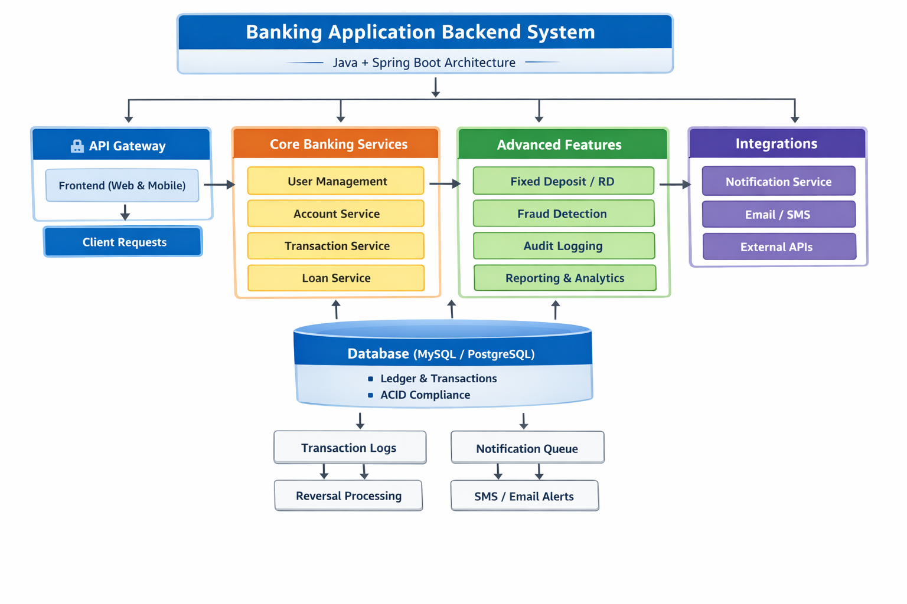
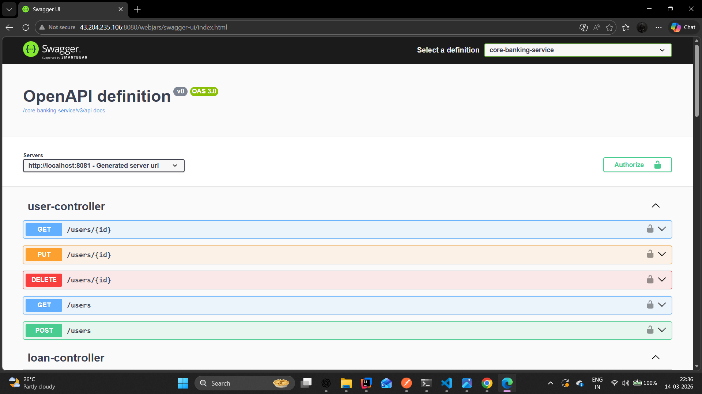
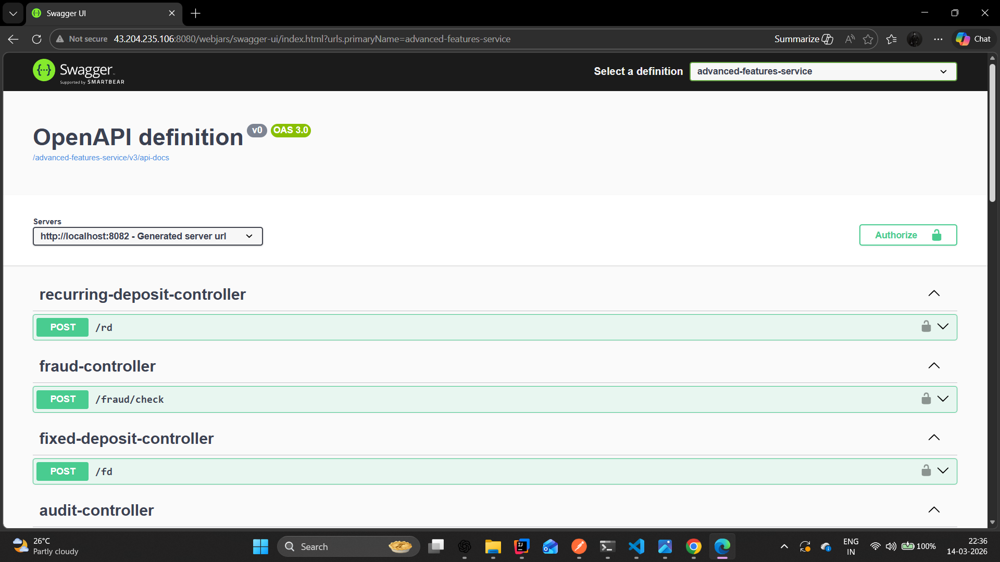

# FluxBank -- Distributed Banking Backend System

A **production-style microservices banking backend** built using **Java,
Spring Boot, and Spring Cloud**.\
The system demonstrates real-world backend engineering practices
including **API Gateway routing, OAuth2 authentication, fraud detection,
financial transaction management, and advanced banking features**.

This project is designed to showcase **enterprise backend architecture**
and is suitable for **backend developer portfolios and recruiter
evaluation**.

------------------------------------------------------------------------

## System Architecture

The backend follows a **microservices architecture** where independent
services handle specific banking responsibilities.

### High Level Flow

Client → API Gateway → Core Banking Services → Advanced Features →
Integrations → Database

------------------------------------------------------------------------

## Key Microservices

### 1. API Gateway

Central entry point for all client requests.

**Responsibilities** - Routes requests to appropriate microservices -
OAuth2 authentication validation - Rate limiting - Security enforcement

**Tech** - Spring Cloud Gateway - Spring Security - OAuth2 Resource
Server

------------------------------------------------------------------------

### 2. Core Banking Service

Handles core banking operations.

**Modules** - User Management - Account Service - Transaction
Processing - Loan Management

**Sample APIs**

    GET    /users
    GET    /users/{id}
    POST   /users
    PUT    /users/{id}
    DELETE /users/{id}

------------------------------------------------------------------------

### 3. Advanced Features Service

Provides advanced financial capabilities.

**Modules** - Fixed Deposit Creation - Recurring Deposit Management -
Fraud Detection - Audit Logging - Financial Reporting

**Sample APIs**

    POST /fd
    POST /rd
    POST /fraud/check

------------------------------------------------------------------------

### 4. Integration Service

Handles communication with external services.

**Capabilities** - Notification Service - Email Integration - SMS
Alerts - External API Integration

------------------------------------------------------------------------

## Database Design

**Database Options** - MySQL - PostgreSQL

**Key Features** - ACID compliant transactions - Ledger-based financial
records - Transaction logs - Notification queue processing

------------------------------------------------------------------------

## Tech Stack

### Backend

-   Java 21
-   Spring Boot
-   Spring Cloud
-   Spring Security
-   Spring Data JPA

### Infrastructure

-   MySQL
-   Redis
-   Keycloak (OAuth2 Authentication)

### DevOps

-   Docker
-   GitHub Actions CI/CD
-   AWS Deployment

------------------------------------------------------------------------

## API Documentation

Interactive API documentation is available using **Swagger UI**.

### Core Banking Service

### Advanced Features Service

Swagger provides:

-   Endpoint documentation
-   Request/response models
-   API testing interface
-   Authentication support

------------------------------------------------------------------------

## Running the Project

### Clone Repository

    git clone https://github.com/yourusername/fluxbank-backend.git
    cd fluxbank-backend

### Build

    mvn clean install

### Run Services

    mvn spring-boot:run

Or run each microservice individually.

------------------------------------------------------------------------

## Security

Authentication and authorization are implemented using **OAuth2 with
Keycloak**.

Features:

-   JWT based authentication
-   Role based access control
-   Secure API gateway routing

------------------------------------------------------------------------

## Project Highlights

-   Real-world **microservices banking architecture**
-   **Secure API gateway**
-   **Fraud detection service**
-   **Financial transaction processing**
-   **Swagger API documentation**
-   **Production style project structure**
-   **Cloud deployable architecture**

------------------------------------------------------------------------

## Folder Structure

    fluxbank
    │
    ├── api-gateway
    ├── core-banking-service
    ├── advanced-features-service
    ├── integration-service
    ├── common-library
    │
    └
------------------------------------------------------------------------

## Future Improvements

-   Event driven architecture using Kafka
-   Distributed tracing with Zipkin
-   Centralized logging using ELK
-   Kubernetes deployment
-   Rate limiting using Redis

------------------------------------------------------------------------

## Author

**Sparsh Chaudhari**\
Java Backend Developer

GitHub: https://github.com/sparshpro  
LinkedIn: https://linkedin.com/in/sparshpro

------------------------------------------------------------------------

## License

This project is intended for **learning and portfolio demonstration
purposes**.
